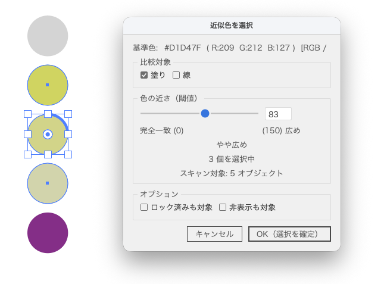

# SelectSimilarColor

選択したオブジェクトと近似色のオブジェクトを一括選択するIllustratorスクリプトです。
スライダーで閾値をリアルタイムに調整しながら、近い色を持つオブジェクトをまとめて選択できます。



---

## こんなときに使えます

- 画像からベクター化（ライブトレース等）したデータで、似た色が大量に使われていて整理したい
- 微妙に色違いのオブジェクトをまとめて1色に統一したい
- 色数を減らしてシンプルにしたい
- Illustrator標準の「共通の塗り色を選択」では拾えない近似色を選択したい

---

## 特徴

- スライダーを動かすとリアルタイムで選択が更新される
- 塗り・線をそれぞれ比較対象に指定可能
- CMYK / RGB / グレースケール / スポットカラーに対応（色空間内で直接比較するため変換誤差なし）
- パス・複合パス・テキスト・グループすべてに対応
- サブレイヤーのネスト構造にも対応

---

## 使い方

1. 基準にしたい色のオブジェクトを1つ選択する
2. メニュー > ファイル > スクリプト > SelectSimilarColor を実行
3. ダイアログのスライダーを動かして閾値を調整（選択はリアルタイムに更新）
4. 「OK（選択を確定）」で選択を維持して閉じる／「キャンセル」で選択を解除
5. カラーパネルから一括で色を変更すればOK

### ダイアログの設定

- **基準色**: 選択オブジェクトから取得した色（HEX・RGB値・色空間・塗り/線の区別を表示）
- **比較対象**: 塗り・線のどちらを比較するか（両方チェック可）
- **閾値スライダー**: 0〜150。大きいほど広い範囲の色を選択
- **スキャン対象**: 認識したオブジェクト数（参考表示）
- **ロック済みも対象**: ロックされたオブジェクトも含める
- **非表示も対象**: 非表示レイヤーのオブジェクトも含める

### 閾値の目安

| 閾値 | 選択される色の範囲 |
|------|-----------------|
| 0 | 完全一致のみ |
| 1〜20 | かなり近い色 |
| 21〜50 | 似た色 |
| 51〜100 | やや広め |
| 101〜150 | 広い範囲 |

### 対応オブジェクト

| 種別 | 塗り | 線 |
|------|:----:|:--:|
| パス | ✅ | ✅ |
| 複合パス | ✅ | ✅ |
| テキスト | ✅ | ✅ |
| グループ（内部を走査） | ✅ | ✅ |
| グラデーション / パターン | ❌ | ❌ |

---

## インストール

`SelectSimilarColor.jsx` を以下のフォルダに配置してください。

**macOS**
```
/Applications/Adobe Illustrator [バージョン]/Presets.localized/ja_JP/スクリプト/
```

**Windows**
```
C:\Program Files\Adobe\Adobe Illustrator [バージョン]\Presets\ja_JP\スクリプト\
```

Illustratorを再起動すると、メニューに表示されます。

毎回配置せずに、任意の場所に置いた `.jsx` ファイルを「ファイル > スクリプト > その他のスクリプト...」から実行することもできます。

### ショートカットキーに割り当てる（おすすめ）

メニュー登録後、以下の手順でファンクションキーを割り当てられます。

1. ウィンドウ > アクション でアクションパネルを開く
2. 新規アクションを作成し、ファンクションキーを設定 → 「記録」→ すぐ「停止」
3. アクションパネルのメニュー（≡）→ 「メニュー項目を挿入...」を選択
4. ファイル > スクリプト > SelectSimilarColor をメニューから選んで「OK」

---

## 動作環境

- Adobe Illustrator CC 以降（30.3 で動作確認済み）
- macOS / Windows

---

## ライセンス

MIT License
